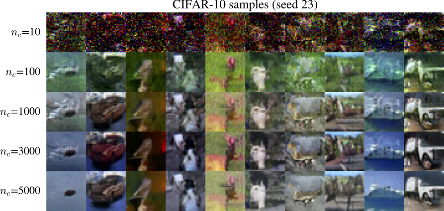
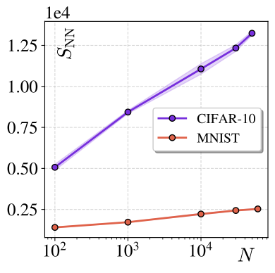

# My Paper Title

This repository is the official implementation of [Neural Entropy](https://arxiv.org/abs/2409.03817v2). 

## 📊 Key Result

Neural entropy is a measure of the information stored in a neural network at the heart of a diffusion model. An important experimental observation from our paper is the logarithmic scaling of neural entropy $S_{\rm NN}$ with the number of training samples $N$. That is, the additional information absorbed by the network per new sample scales nearly as $1/N$.
The visual quality of generated images also reflects this observation: training a diffusion model with $n_c$ samples per class of CIFAR-10 (i.e. $N=10 n_c$) produces improvements in visual quality as $n_c$ increases initially, but there is diminishing returns from training on more samples at larger $n_c$.

<!--  -->
<p float="left">
  
  
</p>

## 🛠️ Setup Instructions

To recreate the environment used in our experiments, use the provided `environment.yml` file:

```bash
conda env create -f environment.yml
conda activate your-env-name
```

## Running the experiments

The repo contains a Jupyter notebook that illustrates the core classes and methods which facilitate the experiments in the paper. These include

- Methods to produce Gaussian mixtures and their analytic scores
- Diffusion models with an MLP core, with different underlying diffusion processes (VP, VPx, SL)
- Diffusion models with U-nets, with and without self-attention layers
- Methods to compute (a lower bound on) log densities $\log p_{\theta}(x)$
- Scripts to progressively train different models and measure their neural entropy, generate samples etc.
- Methods to facilitate data analysis on the experimental results.